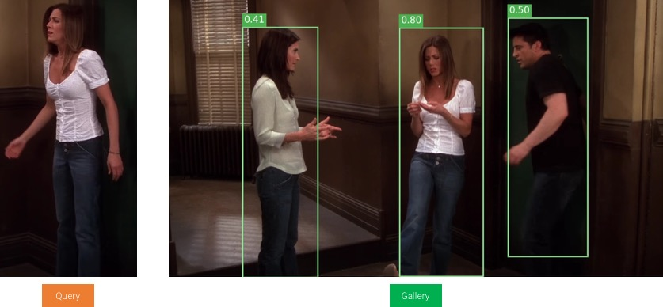
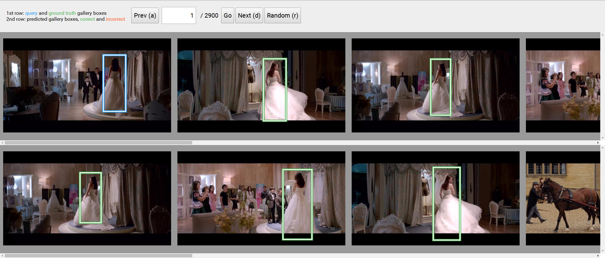

# Person Search Project

This repository hosts the code for our paper [Joint Detection and Identification Feature Learning for Person Search](https://arxiv.org/abs/1604.01850). The code is modified from the py-faster-rcnn written by Ross Girshick.


## Installation

1. Clone this repo **recursively**

  ```Shell
  git clone --recursive https://github.com/ShuangLI59/person_search.git
  ```

2. Build Caffe with python layers and interface

  We modified caffe based on [Yuanjun's fork](https://github.com/yjxiong/caffe/tree/mem), which supports multi-gpu and memory optimization.

  Apart from the official installation [prerequisites](http://caffe.berkeleyvision.org/installation.html), we have several other dependencies:

  - [cudnn-v5.1](https://developer.nvidia.com/cudnn)
  - 1.7.4 < [openmpi](https://www.open-mpi.org/) < 2.0.0
  - boost >= 1.55 (A tip for Ubuntu 14.04: `sudo apt-get autoremove libboost1.54*` then `sudo apt-get install libboost1.55-all-dev`)

  Then compile and install the caffe with
  ```Shell
  cd caffe
  mkdir build && cd build
  cmake .. -DUSE_MPI=ON -DCUDNN_INCLUDE=/path/to/cudnn/include -DCUDNN_LIBRARY=/path/to/cudnn/lib64/libcudnn.so
  make -j8 && make install
  cd ../..
  ```

  Please refer to [this page](https://github.com/yjxiong/caffe/tree/mem#usage) for detailed installation instructions and troubleshooting.

3. Build the Cython modules

  Install some Python packages you might not have: `Cython`, `python-opencv`, `easydict (>=1.6)`, `PyYAML`, `protobuf`, `mpi4py`. Then
  ```Shell
  cd lib && make && cd ..
  ```

## Demo

Download our [**trained model**](https://drive.google.com/open?id=0B67_d0rLRTQYbVFENlVjdXRSWVE) to `output/psdb_train/resnet50/`, then

```Shell
python2 tools/demo.py --gpu 0
```

Or you can use CPU only by setting ``--gpu -1``.




## Experiments

1. Request the dataset from sli [at] ee.cuhk.edu.hk or xiaotong [at] ee.cuhk.edu.hk (academic only). Then

  ```Shell
  experiments/scripts/prepare_data.sh /path/to/the/downloaded/dataset.zip
  ```

2. Download an [ImageNet pretrained](https://drive.google.com/open?id=0B67_d0rLRTQYUHFjU0pPSExhS1U) ResNet-50 model to `data/imagenet_models`.

3. Training with GPU=0

  ```Shell
  experiments/scripts/train.sh 0 --set EXP_DIR resnet50
  ```

  It will finish in around 18 hours, or you may directly download a [**trained model**](https://drive.google.com/open?id=0B67_d0rLRTQYbVFENlVjdXRSWVE) to `output/psdb_train/resnet50/`

4. Evaluation

    By default we use 8 GPUs for faster evaluation. Please adjust the `experiments/scripts/eval_test.sh` with your hardware settings. For example, to use only one GPU, remove the `mpirun -n 8` in L14 and change L16 to `--gpu 0`.

    ```Shell
    experiments/scripts/eval_test.sh resnet50 50000 resnet50
    ```

    The result should be around

    ```Shell
    search ranking:
      mAP = 75.47%
      top- 1 = 78.62%
      top- 5 = 90.24%
      top-10 = 92.38%
    ```

5. Visualization

    The evaluation will also produce a json file `output/psdb_test/resnet50/resnet50_iter_50000/results.json` for visualization. Just copy it to `vis/` and run `python2 -m SimpleHTTPServer`. Then open a browser and go to [http://localhost:8000/vis](http://localhost:8000/vis).

    

## Citation

    @inproceedings{xiaoli2017joint,
      title={Joint Detection and Identification Feature Learning for Person Search},
      author={Xiao, Tong and Li, Shuang and Wang, Bochao and Lin, Liang and Wang, Xiaogang},
      booktitle={CVPR},
      year={2017}
    }

## Repo History

The first version of our paper was published in 2016. We have made substantial improvements since then and published a new version of paper in 2017. The original code was moved to branch `v1` and the new code has been merged to `master`. If you have checked out our code before, please be careful on this and we recommend clone recursively into a new repo instead.
